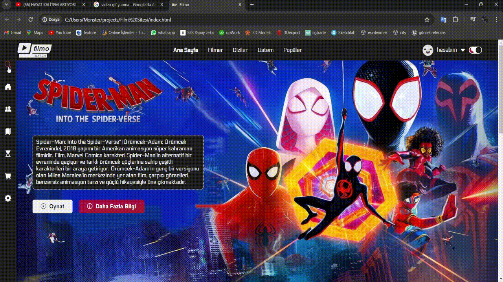

# Filmo

Filmo, sinema tutkunlarının en sevdikleri filmleri keşfetmeleri ve paylaşmaları için tasarlanmış bir film sitesidir.  (Bu bir proje ödevi)

## Özellikler

1. **Hover Efekti:** Filmlerin üzerine gelindiğinde düğmelerin rengi değişir, böylece kullanıcılar üzerlerine gelirken etkileşim hissederler.

   

2. **Dark ve White Mod:** Kullanıcılar istedikleri modu seçebilirler. Dark mod gece izleme deneyimi için idealdir, white mod ise gündüzleri daha rahat bir deneyim sunar.

   
   

3. **Detaylı Görünüm:** Seçilen bir film kutucuğuna tıklandığında, kutu büyür ve film hakkında daha fazla detay görüntülenir.

   

4. **Kutuların Kaydırılabilirliği:** Sayfa üzerindeki film kutuları sağa doğru kaydırılabilir, böylece kullanıcılar daha fazla film görebilirler.

   

5. **Beyaz Mod Görünümü:** Beyaz modda Filmo'nun nasıl göründüğünü görmek için aşağıya bakınız.

   

## Teknolojiler

Filmo, aşağıdaki teknolojiler kullanılarak geliştirilmiştir:

- HTML
- CSS
- JavaScript

